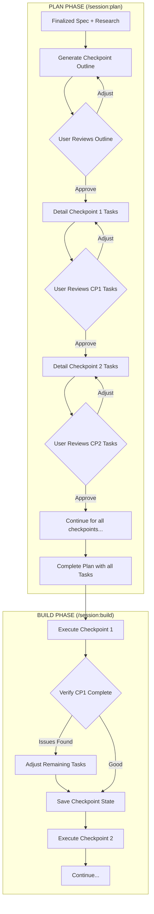

# Enhancing Agent-Session Plan Phase

> **Session**: `2025-12-24_enhancing-plan-mode_k7m3x9`
> **Status**: ✅ Finalized
> **Created**: 2025-12-24
> **Finalized**: 2025-12-24

## Overview

Adapt the existing external 4-phase planning system into the **agent-session workflow's plan phase** (not Claude Code's native plan mode). The goal is to bring the structured, checkpoint-based planning approach with IDK (Information-Dense Keywords) task definitions directly into the `/session:plan` command, leveraging finalized specs and prior research as inputs.

**Important distinction**: This is about the agent-session skill's plan phase (`/session:plan`), which is a custom workflow in this repository - NOT Claude Code's built-in `EnterPlanMode` feature.

## Problem Statement

The current agent-session plan phase is relatively basic - it produces a plan.md with implementation steps, but lacks:
- The structured decomposition into sequential checkpoints
- Task tranches for parallelizable work
- IDK-based precise task definitions
- File context tracking (beginning → ending states)
- The rigor of the external Gemini-based planning system

The external system works but requires:
- Running Jupyter notebooks outside Claude Code
- Manual context transfer between systems
- Separate API calls to Gemini
- No integration with the spec/plan/build workflow

**The opportunity**: Bring this proven planning methodology directly into Claude Code, where Claude can execute the entire flow natively using the finalized spec and research as inputs.

## Goals

### High-Level Goals

Bring the full power of structured, checkpoint-based planning with IDK task definitions into the agent-session plan phase, with an **iterative, user-confirmed workflow** that allows for course correction at each stage.

### Mid-Level Goals

1. **Outline-First Planning**: Generate checkpoint outline first, get user confirmation before detailing
2. **Phase-by-Phase Detailing**: Break down tasks one checkpoint at a time, with user review between each
3. **Adaptive Execution**: During build phase, verify each checkpoint before moving on - adjust remaining tasks if needed
4. **Progressive Disclosure**: Don't frontload all detail generation; reveal complexity incrementally

### Detailed Goals

*To be added as understanding develops*

## Non-Goals

*What we are explicitly NOT building - prevents scope creep*

- Modifying Claude Code's native `EnterPlanMode` feature
- (More to be defined)

## Success Criteria

*How do we know we're done? Testable outcomes*

- [ ] (To be defined after goals are clear)

## Context & Background

### Existing External System Components (from research)

#### 1. IDK (Information-Dense Keywords) System
A vocabulary of 40+ precise action keywords that serve as "opcodes" for AI coding:

**Core Categories:**
- **CRUD**: CREATE, UPDATE, DELETE
- **Actions**: ADD, REMOVE, MOVE, REPLACE, MIRROR, MAKE, USE, APPEND
- **Language**: VAR, FUNCTION, CLASS, TYPE, FILE, DEFAULT
- **Location**: BEFORE, AFTER
- **Refactoring**: REFACTOR, RENAME, SPLIT, MERGE, EXTRACT, INLINE, INSERT, WRAP
- **Testing**: TEST, ASSERT, MOCK, VERIFY, CHECK
- **Documentation**: COMMENT, DOCSTRING, ANNOTATE
- **Styling**: LINT, FORMAT, TIDY

**Task Format:**
```
CREATE src/example/data_types.py:
    CREATE pydantic types:
        WordCounts(BaseModel):
            count_to_word_map: Dict[str, int]
```

#### 2. 4-Phase Workflow (from notebooks)

| Phase | Purpose | Outputs |
|-------|---------|---------|
| **Phase 1: Initialization** | Load files, analyze context, generate objective | files_dict, file_analyses, raw_inputs |
| **Phase 2: Checkpoint Outline** | Break into ordered milestones (3-7 typically) | checkpoint_outline with prerequisites |
| **Phase 3: Detailed Planning** | Create task tranches and low-level tasks | Full RequestCheckpoint objects |
| **Phase 4: Output Formatting** | Generate Claude Code-ready XML | checkpoint_X.xml, context_prime_X.xml |

#### 3. Hierarchical Task Structure

```
Checkpoint (sequential milestone)
├── Task Tranche 1 (parallelizable group)
│   ├── Low-Level Task 1.1.1 (depends_on: [])
│   ├── Low-Level Task 1.1.2 (depends_on: [1.1.1])
│   └── Low-Level Task 1.1.3 (depends_on: [1.1.1])
└── Task Tranche 2 (can run after Tranche 1)
    ├── Low-Level Task 1.2.1
    └── Low-Level Task 1.2.2
```

#### 4. File Context Tracking
- **beginning_files**: State at checkpoint start
- **ending_files**: Projected state after checkpoint completion
- **Continuity**: Ending files of checkpoint N become beginning files of checkpoint N+1

#### 5. Low-Level Task Structure (Original)
```json
{
  "task_id": "1.1.1",
  "file_path": "src/example.py",
  "description": "What to do",
  "action_details": "CREATE function_name(...): ...",
  "complexity": 3,
  "depends_on": []
}
```

#### 6. Enhanced Task Structure (Proposed)

**Key enhancements:**
- **Title**: Short one-sentence max summary
- **Context**: Pre-loaded references (files, lines, docs) so agent can execute without searching
- **Subtasks**: For file-scoped work to avoid cross-cutting concerns with parallel agents
- **Status tracking**: Directly in plan.json

```json
{
  "id": "1.1.1",
  "title": "Add user validation function",
  "file_path": "src/auth/validators.py",
  "description": "Detailed description of what to do",
  "action": "CREATE validate_user(...):\n    ...",
  "context": {
    "read_before": [
      { "file": "src/auth/types.py", "lines": "1-50", "purpose": "Understand User type" },
      { "file": "docs/auth-flow.md", "purpose": "Reference auth requirements" }
    ],
    "related_files": ["src/auth/session.py"]
  },
  "depends_on": [],
  "status": "pending",
  "subtasks": []
}
```

#### 7. Hierarchy Clarification

```
Checkpoint (sequential milestone)
├── File Context: beginning/ending state + file tree visualization
├── Testing Strategy: how to verify this checkpoint works
├── Tranche 1 (parallelizable - multiple agents could work on this)
│   ├── Task 1.1.1 (with pre-loaded context)
│   │   ├── Subtask 1.1.1.1 (file-scoped, avoids cross-cutting)
│   │   └── Subtask 1.1.1.2
│   └── Task 1.1.2
└── Tranche 2 (can run in parallel with Tranche 1)
    └── Task 1.2.1
```

**Purpose of each level:**
- **Tranches**: Non-blocking groups for parallel agent execution
- **Tasks**: Units within a tranche with full context
- **Subtasks**: File-scoped work when task touches one file deeply

## Key Decisions

| Decision | Rationale | Date |
|----------|-----------|------|
| Adapt existing system vs. build from scratch | Preserve proven patterns while achieving native integration | 2025-12-24 |
| Agent-session plan phase, not native plan mode | Keep systems separate; agent-session is our custom workflow | 2025-12-24 |
| Iterative, phase-by-phase workflow | Generate outline first, confirm, then detail each checkpoint one at a time with user review between each | 2025-12-24 |
| Build phase includes checkpoint verification | After each checkpoint execution, verify state and allow task adjustment if unexpected issues arise | 2025-12-24 |
| State-aware single command | `/session:plan [id]` detects current state and guides conversationally - fluid, no explicit subcommands | 2025-12-24 |
| JSON as source of truth | plan.json is the primary format (structured, editable, machine-readable); plan.md auto-generated via hook/script for human readability | 2025-12-24 |
| Plan = execution steps only | No diagrams or architectural overview in plan - that belongs in spec. Plan is focused purely on implementation steps | 2025-12-24 |
| Keep file context with tree visualization | Quality check for before/after state - did it create proper files? Loading correctly? Includes file tree option | 2025-12-24 |
| Pre-loaded context per task | Each task includes references (files, lines, docs) so agent can execute without searching - front-loads context gathering | 2025-12-24 |
| Support subtasks | For file-scoped work to avoid cross-cutting concerns when multiple agents work in parallel | 2025-12-24 |
| Tasks have short titles | One-sentence max summary for quick scanning | 2025-12-24 |
| Task status in plan.json | Keep status directly in plan file (may move to state.json later) | 2025-12-24 |
| Testing strategy per checkpoint | Each checkpoint includes how to verify it works | 2025-12-24 |
| IDKs organized in skill by category | Restructure agent-session skill by phase (spec/plan/build); IDKs in plan subdirectory, one file per category (CRUD, Actions, etc.) | 2025-12-24 |
| IDKs are agent-internal | Users don't see raw IDK vocabulary; they see rendered plan. Agent progressively learns IDKs from skill files | 2025-12-24 |
| Full structure, flexible interaction | All tasks need full plan structure, but simple tasks can skip iterative confirmation - agent can generate full plan in one pass | 2025-12-24 |
| Plan state in state.json | Add plan_state section with current checkpoint, progress overview so agent doesn't need to re-read full plan on resume | 2025-12-24 |
| ASCII tree for human review | File tree visualization is simple ASCII in JSON; primarily for rendered plan.md. Agent uses parsed file list | 2025-12-24 |
| Progressive disclosure skill structure | SKILL.md routes to phase OVERVIEWs; each phase has own templates/ and resources (like idk/ for plan). Reduces context loading. | 2025-12-24 |
| Templates per phase folder | Each phase (spec/, plan/, build/) has its own templates/ subfolder rather than shared top-level templates/ | 2025-12-24 |

## Open Questions

- [x] Should checkpoints be generated automatically or interactively with user? → **Outline generated, user confirms, then phase-by-phase detailing with confirmation**
- [x] How should the IDK vocabulary be exposed to users? → **IDKs are agent-internal; users see rendered plan. IDKs organized in skill files by category for agent to progressively learn**
- [x] Should plan mode produce JSON, markdown, or both? → **JSON (plan.json) as source of truth; plan.md auto-generated via hook/script**
- [x] How to handle the 4-phase workflow - all at once or incrementally? → **Incrementally: outline first, then detail each checkpoint one at a time**
- [x] What's the right balance between rigor and speed? → **Full structure always, but simple tasks can skip iterative confirmation - agent generates in one pass**
- [x] How does the plan phase output feed into the build phase? → **Complete plan with all checkpoint tasks feeds into build; build executes checkpoint-by-checkpoint with verification**
- [x] What commands/subcommands should drive this workflow? → **State-aware single command: `/session:plan [id]` detects state and guides conversationally**
- [x] How is checkpoint state persisted between sessions? → **Add plan_state to state.json with current checkpoint, progress overview for quick resume**
- [x] What is the exact JSON schema for plan.json? → **See proposed schema below**
- [x] How should file tree visualization look in file_context? → **Simple ASCII tree in JSON; primarily for human review in rendered plan.md. Agent uses parsed file list.**
- [x] Where does testing strategy fit in the checkpoint structure? → **Per checkpoint, with approach and verification_steps**

## Diagrams

### Proposed Iterative Planning & Build Flow



### Key Interaction Points

```
PLAN PHASE:
┌─────────────────────────────────────────────────────────────┐
│  1. Generate Outline ─────► User Confirms                   │
│  2. Detail CP1 Tasks ─────► User Confirms                   │
│  3. Detail CP2 Tasks ─────► User Confirms                   │
│  4. ... repeat for each checkpoint ...                      │
│  5. Full Plan Ready                                         │
└─────────────────────────────────────────────────────────────┘

BUILD PHASE:
┌─────────────────────────────────────────────────────────────┐
│  1. Execute CP1 ─────► Verify State ─────► Save Checkpoint  │
│  2. Execute CP2 ─────► Verify State ─────► Save Checkpoint  │
│     (if unexpected: adjust remaining tasks)                 │
│  3. ... repeat until complete ...                           │
└─────────────────────────────────────────────────────────────┘
```

## Notes

### Key Patterns to Preserve
1. **IDK vocabulary** - The core language for precise task definitions
2. **Checkpoint sequencing** - Major milestones with prerequisites
3. **Task tranches** - Parallelizable work groups
4. **File context tracking** - Beginning → ending state evolution
5. **Dependency management** - Within-tranche task dependencies
6. **Hierarchical task IDs** - `checkpoint.tranche.task` format (e.g., 1.1.1)

### Adaptation Considerations
- The external system uses Gemini; agent-session uses Claude
- External system uses XML extensively; using JSON in agent-session
- Notebooks → integrated into `/session:plan` command
- Separate prompts → integrated into plan phase workflow
- The input is now the finalized spec + research from spec phase

### File Organization (Session Directory)

```
agents/sessions/{session-id}/
├── state.json           # Session state and phase tracking (includes plan_state)
├── spec.md              # WHAT: Goals, requirements, context, diagrams
├── plan.json            # HOW: Structured execution steps (source of truth)
├── plan.md              # HOW: Human-readable version (auto-generated)
├── research/            # Research artifacts from spec phase
└── context/             # Supporting context (diagrams, notes, etc.)
```

### Skill Structure (Progressive Disclosure Architecture)

The agent-session skill uses **progressive disclosure** - SKILL.md routes to phase-specific OVERVIEWs, which link to detailed resources.

```
.claude/skills/agent-session/
├── SKILL.md                        # Purpose + Overview + Routes to phase OVERVIEWs
│
├── spec/
│   ├── OVERVIEW.md                 # Spec phase workflow & instructions
│   └── templates/
│       ├── spec.md                 # Spec document template
│       └── state.json              # Initial session state template
│
├── plan/
│   ├── OVERVIEW.md                 # Plan phase workflow & IDK reference table
│   ├── templates/
│   │   └── plan.json               # Plan structure template
│   └── idk/                        # IDK instruction sets (agent-internal)
│       ├── crud.md                 # CREATE, UPDATE, DELETE
│       ├── actions.md              # ADD, REMOVE, MOVE, REPLACE, MIRROR, MAKE, USE, APPEND
│       ├── language.md             # VAR, FUNCTION, CLASS, TYPE, FILE, DEFAULT
│       ├── location.md             # BEFORE, AFTER
│       ├── refactoring.md          # REFACTOR, RENAME, SPLIT, MERGE, EXTRACT, INLINE, INSERT, WRAP
│       ├── testing.md              # TEST, ASSERT, MOCK, VERIFY, CHECK
│       └── documentation.md        # COMMENT, DOCSTRING, ANNOTATE
│
└── build/
    ├── OVERVIEW.md                 # Build phase workflow & instructions
    └── templates/
        └── ...                     # TBD
```

#### How Progressive Disclosure Works

```
User invokes: /session:plan my-session

1. SKILL.md is read (always)
   ├── Purpose: "Structured session management..."
   ├── Session Lifecycle overview
   └── Routes to: plan/OVERVIEW.md

2. plan/OVERVIEW.md is read (phase-specific)
   ├── Prerequisites, Workflow
   ├── IDK Reference Table (links to idk/*.md)
   └── Output expectations

3. idk/crud.md, actions.md, etc. (detail level)
   └── Loaded when generating task definitions
```

#### SKILL.md Structure

```markdown
---
name: agent-session
description: Manage development sessions with spec/plan/build workflow
---

# Purpose

Structured session management for the development cycle: **SPEC → PLAN → BUILD**

Each phase has dedicated instructions in its OVERVIEW.md file.

## Variables

SESSIONS_DIR: agents/sessions
SKILL_DIR: .claude/skills/agent-session

## Session Lifecycle

┌──────────┐     ┌──────────┐     ┌──────────┐
│   SPEC   │────▶│   PLAN   │────▶│  BUILD   │
│  (WHAT)  │     │  (HOW)   │     │  (DO)    │
└──────────┘     └──────────┘     └──────────┘

## Phases

### Spec Phase
Define WHAT to build and WHY.
→ Read: `spec/OVERVIEW.md`

### Plan Phase
Design HOW to implement with checkpoints and tasks.
→ Read: `plan/OVERVIEW.md`

### Build Phase
Execute the plan checkpoint by checkpoint.
→ Read: `build/OVERVIEW.md`

## Session Directory Structure

agents/sessions/{session-id}/
├── state.json       # Session state and progress
├── spec.md          # WHAT: Goals, requirements, context
├── plan.json        # HOW: Checkpoints and tasks (source of truth)
├── plan.md          # HOW: Human-readable (auto-generated)
├── research/        # Research artifacts
└── context/         # Supporting materials
```

#### plan/OVERVIEW.md Structure

```markdown
# Plan Phase

Design HOW to implement the finalized spec using structured checkpoints and tasks.

## Prerequisites

- Finalized spec (status: finalized in state.json)
- Research artifacts loaded (if any)

## Workflow

1. Load finalized spec
2. Generate checkpoint outline → User confirms
3. Detail each checkpoint one at a time → User confirms each
4. Finalize complete plan

## Task Definitions

Use IDK (Information-Dense Keywords) for precise task actions.

### IDK Reference

| Type | Description | File |
|------|-------------|------|
| **CRUD** | Core operations: creating, updating, deleting code elements | [`idk/crud.md`](idk/crud.md) |
| **Actions** | Modification operations: adding, removing, moving, replacing content | [`idk/actions.md`](idk/actions.md) |
| **Language** | Code constructs: variables, functions, classes, types, files | [`idk/language.md`](idk/language.md) |
| **Location** | Positioning: placing code before or after existing elements | [`idk/location.md`](idk/location.md) |
| **Refactoring** | Restructuring: renaming, splitting, merging, extracting code | [`idk/refactoring.md`](idk/refactoring.md) |
| **Testing** | Verification: tests, assertions, mocks, checks | [`idk/testing.md`](idk/testing.md) |
| **Documentation** | Annotation: comments, docstrings, inline docs | [`idk/documentation.md`](idk/documentation.md) |

## Output

- `plan.json` - Structured checkpoint/task data
- `plan.md` - Rendered for human review
- `state.json` - Updated with plan_state progress
```

### Proposed plan_state in state.json

```json
{
  "plan_state": {
    "status": "in_progress",
    "current_checkpoint": 2,
    "current_tranche": "2.1",
    "current_task": "2.1.3",
    "checkpoints_completed": [1],
    "last_updated": "2025-12-24T12:00:00Z",
    "summary": "Completed checkpoint 1 (core types). Working on checkpoint 2 (API endpoints), task 2.1.3 (user validation)."
  }
}
```

This allows the agent to quickly understand:
- Where we are in the plan
- What's been completed
- Brief summary for context without reading full plan

### Separation of Concerns

| Document | Purpose | Content |
|----------|---------|---------|
| **spec.md** | Define WHAT | Goals, requirements, context, diagrams, key decisions, non-goals |
| **plan.json** | Define HOW (structured) | Checkpoints, task tranches, low-level tasks with IDK commands |
| **plan.md** | Define HOW (readable) | Auto-generated from plan.json for human review |

### Proposed plan.json Schema

```json
{
  "session_id": "2025-12-24_feature-name_abc123",
  "spec_reference": "./spec.md",
  "created_at": "2025-12-24T00:00:00Z",
  "updated_at": "2025-12-24T00:00:00Z",
  "status": "draft|in_progress|complete",

  "checkpoints": [
    {
      "id": 1,
      "title": "Implement Core Data Types",
      "goal": "Create the foundational types and interfaces",
      "prerequisites": [],
      "status": "pending|in_progress|complete",

      "file_context": {
        "beginning": {
          "files": [
            { "path": "src/types/index.ts", "status": "exists", "description": "Current type definitions" }
          ],
          "tree": "src/\n├── types/\n│   └── index.ts\n└── utils/"
        },
        "ending": {
          "files": [
            { "path": "src/types/index.ts", "status": "modified", "description": "Extended with new types" },
            { "path": "src/types/user.ts", "status": "new", "description": "User-specific types" }
          ],
          "tree": "src/\n├── types/\n│   ├── index.ts\n│   └── user.ts\n└── utils/"
        }
      },

      "testing_strategy": {
        "approach": "Type checking and unit tests",
        "verification_steps": [
          "Run tsc --noEmit to verify types compile",
          "Run jest src/types/__tests__"
        ]
      },

      "tranches": [
        {
          "id": "1.1",
          "goal": "Create base type definitions",
          "tasks": [
            {
              "id": "1.1.1",
              "title": "Define User type",
              "file_path": "src/types/user.ts",
              "description": "Create User type with required fields",
              "action": "CREATE src/types/user.ts:\n    CREATE TYPE User:\n        id: string\n        email: string\n        ...",
              "context": {
                "read_before": [
                  { "file": "src/types/index.ts", "lines": "1-20", "purpose": "Understand existing type patterns" },
                  { "file": "docs/data-model.md", "purpose": "Reference data model spec" }
                ],
                "related_files": ["src/api/users.ts"]
              },
              "depends_on": [],
              "status": "pending",
              "subtasks": [
                {
                  "id": "1.1.1.1",
                  "title": "Add validation schema",
                  "description": "Add zod schema for User type",
                  "action": "ADD UserSchema using zod...",
                  "status": "pending"
                }
              ]
            }
          ]
        }
      ]
    }
  ]
}
```

---
*This spec was finalized on 2025-12-24. Ready for plan phase.*
