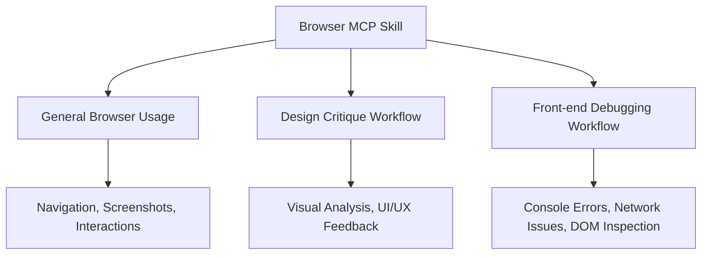

# Browser MCP Skill

> **Session**: `2026-01-06_browser-mcp-skill_b7k2m9`
> **Status**: ✅ Finalized
> **Created**: 2026-01-06
> **Finalized**: 2026-01-06

## Overview

A skill for leveraging browser MCP (Model Context Protocol) capabilities, providing both general browser automation guidance and specialized workflows for design critique and front-end debugging.

## Problem Statement

**The manual back-and-forth tax in front-end debugging.**

When debugging front-end issues, the current workflow requires constant manual mediation:
1. User describes an issue
2. User manually screenshots the browser
3. User manually copies console logs
4. User pastes these into the conversation
5. Agent analyzes and suggests next steps
6. Repeat the entire cycle

This friction accumulates quickly — each round-trip requires context switching, and information gets lost or stale between exchanges.

**Why Browser MCP changes this:**
- Connects to the user's *actual* Chrome browser (no Selenium/Puppeteer infrastructure)
- Authentication is already handled (logged into real accounts)
- Agent can directly capture screenshots and console logs
- Enables an autonomous debugging loop without manual information transfer

## Goals

### High-Level Goals

**Collaborative debugging workflow** — Agent handles the mechanical back-and-forth (screenshots, logs, instrumentation, refreshes) while user stays in the loop for judgment calls and confirmations. Not fully autonomous — but dramatically reduces friction.

### Mid-Level Goals

1. **Setup**: Observe current URL via snapshot, confirm with user
2. **Observe**: Capture current state (console logs + screenshot) without user copy/paste
3. **Instrument**: Strategically add console.logs to source code for deeper visibility
4. **Verify**: Refresh page, capture new logs + screenshots, analyze
5. **Iterate**: Repeat instrumentation cycle until root cause is identified
6. **Propose & Confirm**: Explain root cause, propose fix, get user approval
7. **Fix & Verify**: Implement fix, refresh, confirm with user it works
8. **Cleanup**: Remove all temporary debug instrumentation

### Detailed Goals

*Specific behaviors or features - added as conversation progresses.*

#### Debugging Workflow

```
┌─────────────────────────────────────────────────────────────────────┐
│                    DEBUGGING WORKFLOW                               │
├─────────────────────────────────────────────────────────────────────┤
│                                                                     │
│  0. SETUP PHASE                                                     │
│     User: "I'm having this issue..."                                │
│     Agent: browser_snapshot to see current URL and page state       │
│     Agent: "I see you're on [URL]. Is this where the issue is?"     │
│     User confirms OR provides different URL → agent navigates       │
│                                                                     │
│  1. INITIAL OBSERVATION                                             │
│     Agent: screenshot + get_console_logs (now on confirmed page)    │
│                                                                     │
│  2. ANALYSIS                                                        │
│     Agent analyzes visual state + existing logs                     │
│     Determines: enough info? or need more visibility?               │
│                                                                     │
│  3. INSTRUMENTATION (if needed)                                     │
│     Agent edits source code → adds strategic console.logs           │
│     Tracks what was added for later cleanup                         │
│                                                                     │
│  4. REFRESH & CAPTURE                                               │
│     Agent uses browser_navigate to same URL (full refresh)          │
│     → Clears console logs for clean slate                           │
│     → Hot reload may have applied changes, but nav ensures fresh    │
│     Agent captures new console output + fresh screenshot            │
│                                                                     │
│  5. ITERATE                                                         │
│     Repeat steps 2-4 until issue is understood                      │
│                                                                     │
│  6. PROPOSE & CONFIRM                                               │
│     Agent explains root cause + proposes fix                        │
│     User confirms: "Yes, apply that fix" or redirects               │
│                                                                     │
│  7. FIX & VERIFY                                                    │
│     Agent implements the fix                                        │
│     Agent refreshes, captures state                                 │
│     Agent: "Does this look like it's working properly?"             │
│     User confirms resolution                                        │
│                                                                     │
│  8. CLEANUP                                                         │
│     Agent removes all temporary debug logs it added                 │
│     Codebase returns to clean state (fix remains)                   │
│                                                                     │
└─────────────────────────────────────────────────────────────────────┘
```

### Debug Log Convention

Agent-added instrumentation follows a structured format — **all in one `console.log()` call** so browser devtools groups it as a single expandable entry:

```javascript
console.log('[DEBUG-AGENT]', '[ComponentName.functionName]', { relevantData });
//           ^^^^^^^^^^^^    ^^^^^^^^^^^^^^^^^^^^^^^^^^^^    ^^^^^^^^^^^^^^^^
//           Marker          Context/Location                Inspectable data
```

**Example in practice:**
```javascript
console.log('[DEBUG-AGENT]', '[UserAuth.fetchData]', { token, userId, response });
console.log('[DEBUG-AGENT]', '[CartContext.addItem]', { item, currentCart });
```

**Why single-call format:**
- Browser console groups arguments from one `console.log()` as a single entry
- Data objects are expandable/inspectable in devtools
- Different from terminal logs (Python, etc.) where you might use multiple print statements

**Why this structure:**
- `[DEBUG-AGENT]` — Marker for cleanup (grep-able, distinctive)
- `[Context]` — Where in the code/flow this log lives
- `{data}` — The actual values being inspected (expandable in browser)

**Cleanup strategy:**
1. Primary: Find all lines with `[DEBUG-AGENT]` marker and remove
2. Fallback: Git diff to see what was added (careful not to overwrite user's other changes)

**Log placement approach:**
Agent decides placement contextually based on the specific issue. Some common patterns for reference:
- Component boundaries (props in, render out)
- Before/after async operations (fetches, timers)
- Data transformation points
- Event handlers and callbacks
- State updates

*Not prescriptive — agent uses judgment based on the problem at hand.*

---

#### Design Critique Workflow

```
┌─────────────────────────────────────────────────────────────────────┐
│                    DESIGN CRITIQUE WORKFLOW                         │
├─────────────────────────────────────────────────────────────────────┤
│                                                                     │
│  1. CONTEXT GATHERING (required before proceeding)                  │
│     Agent infers from visual + code:                                │
│     - Purpose of the app                                            │
│     - Purpose of this specific page                                 │
│     - Goals of the page (what should user accomplish?)              │
│                                                                     │
│     Agent presents understanding: "Here's what I think this is..."  │
│     User confirms or corrects                                       │
│     → Must have confirmed context before critique begins            │
│                                                                     │
│  2. VISUAL CAPTURE                                                  │
│     Agent takes screenshots of the page/app                         │
│     May navigate through different states/views                     │
│     Captures both desktop and mobile viewports if relevant          │
│                                                                     │
│  3. ANALYSIS (Jony Ive Perspective)                                 │
│     For each screen/state, examine:                                 │
│     - What works well?                                              │
│     - What doesn't?                                                 │
│     - What is confusing or unclear?                                 │
│     - What feels redundant or unnecessary?                          │
│                                                                     │
│  4. DESIGN PRINCIPLES CHECK                                         │
│     Evaluate against core principles:                               │
│     - Icons over emojis                                             │
│     - Padding/spacing — not too cramped, not too sparse             │
│     - Sleek, premium, minimalist aesthetic                          │
│     - Cohesive color palette (avoid unnecessary colors)             │
│     - Responsive and elegant on both desktop and mobile             │
│                                                                     │
│  5. REPORT & RECOMMENDATIONS                                        │
│     Structured output:                                              │
│     - Summary of current state                                      │
│     - Specific issues identified                                    │
│     - Redesign recommendations                                      │
│     - Priority order for changes                                    │
│                                                                     │
│  6. ITERATIVE REFINEMENT (optional)                                 │
│     User and agent collaborate to refine the critique:              │
│     - "What about this element?"                                    │
│     - "Can you look at the mobile view?"                            │
│     - "How would you handle [specific component]?"                  │
│     Continue until user is satisfied with the analysis              │
│                                                                     │
│  7. SAVE & HANDOFF                                                  │
│     Save critique to: agents/design-sessions/{id}/                  │
│     - critique.md — The full critique report                        │
│     - context.md — Confirmed app/page purpose and goals             │
│     - screenshots/ — Visual captures used in analysis               │
│                                                                     │
│     Can feed into planning phase when ready                         │
│     (Structure may evolve as session system matures)                │
│                                                                     │
└─────────────────────────────────────────────────────────────────────┘
```

### Design Critique Principles

**The Jony Ive Lens:**
> "Really think. Really, really think."

The critique should feel like Jony Ive designed it — embodying what the user would think and turning those thoughts into elegant solutions. The bar: "Would Steve Jobs smile at this?"

**Target Aesthetic:**
- Sleek, premium, minimalist
- Like a spa in Switzerland
- Worth thousands of dollars a month
- Every element earns its place

**Specific Guidelines:**
- Use icons, not emojis
- Perfect padding — components spaced intentionally
- Cohesive color palette — pick it and stick to it
- Responsive design — elegant on desktop AND mobile
- Nothing redundant, nothing unclear

### Interaction Model

**What the agent handles** (mechanical/tedious):
- Taking screenshots
- Capturing console logs
- Adding/removing debug instrumentation
- Refreshing the page
- Navigating to URLs

**Where user stays in the loop** (judgment calls):
- Confirming the right page/URL
- Approving proposed fixes before they're applied
- Verifying the fix actually resolved the issue
- Redirecting if agent's diagnosis seems off

## Non-Goals

*What we are explicitly NOT building - prevents scope creep*

- Category-specific debugging optimizations (for now — can iterate based on usage patterns)
- Staging/production debugging (requires different approach since can't instrument code)
- Fully autonomous debugging without user confirmation checkpoints

## Success Criteria

*How do we know we're done? Testable outcomes*

### Debugging Workflow
- [ ] Can start debugging session with `browser_snapshot` to confirm URL
- [ ] Can capture console logs and screenshots without manual copy/paste
- [ ] Can add debug instrumentation with `[DEBUG-AGENT]` marker
- [ ] Can refresh page via `browser_navigate` and capture new state
- [ ] Can clean up all debug logs at end of session
- [ ] User confirms at key decision points (URL, fix approval, verification)

### Design Critique Workflow
- [ ] Can infer app/page purpose from visual + code
- [ ] User confirms context before critique proceeds
- [ ] Can capture screenshots across different states/viewports
- [ ] Produces critique using Jony Ive lens and design principles
- [ ] Saves output to `agents/design-sessions/{id}/`
- [ ] Supports iterative refinement with user

## Context & Background

### Browser MCP Server

**Package**: `@browsermcp/mcp@latest`
**Config location**: `mcp-configs/.mcp.json.browsermcp`

**Key differentiator**: Connects to user's actual Chrome browser — no separate browser instance, no auth flows needed.

### Available Tools

| Tool | Purpose |
|------|---------|
| `browser_navigate` | Navigate to URL |
| `browser_go_back` / `browser_go_forward` | History navigation |
| `browser_snapshot` | Get DOM/page state |
| `browser_click` / `browser_hover` | Element interactions |
| `browser_type` | Text input |
| `browser_select_option` | Dropdown selection |
| `browser_press_key` | Keyboard input |
| `browser_wait` | Wait for conditions |
| `browser_get_console_logs` | **Key for debugging** — direct console access |
| `browser_screenshot` | **Key for debugging** — visual capture |

### Workflows

1. **Front-end Debugging** — Collaborative debugging with instrumentation and cleanup
2. **Design Critique** — Jony Ive-style visual analysis with redesign recommendations (critique-focused, feeds into plan)

## Key Decisions

*Capture the WHY behind decisions, not just the WHAT. Include user's reasoning and preferences.*

| Decision | Rationale | Date |
|----------|-----------|------|
| Debugging workflow includes code instrumentation with cleanup | Agent observes existing logs first, surgically adds console.logs when needed, removes all temp instrumentation at the end | 2026-01-06 |
| Use browser_navigate for refresh (not just hot reload) | Even with hot reload, explicit navigation clears console logs and ensures truly fresh page state | 2026-01-06 |
| Primary environment: Local dev server with hot reload | Most common debugging scenario; staging/production debugging would need different approach | 2026-01-06 |
| Setup phase: observe current URL first, confirm with user | Agent snapshots current page, confirms if that's the right place. Collaborative - not fully autonomous or fully manual | 2026-01-06 |
| Collaborative workflow with user confirmations | Agent handles mechanical tedium; user stays in loop for judgment calls (URL confirm, fix approval, verify resolution). Reduces friction without removing human oversight | 2026-01-06 |
| Debug log convention: single console.log with marker | Format: `console.log('[DEBUG-AGENT]', '[Context]', { data })`. Browser groups as single expandable entry. Cleanup via grep for marker, git diff as fallback | 2026-01-06 |
| General-purpose debugging, not category-specific | No consistent pain points yet. Build foundation first, iterate and specialize based on real usage patterns | 2026-01-06 |
| Log placement: agent judgment with light guidance | Trust agent to decide contextually. Include common patterns as reference, not prescription | 2026-01-06 |
| Design critique: analysis-focused, not implementation | Critique gathers info, produces report, supports iterative refinement. Output feeds into plan mode for implementation | 2026-01-06 |
| Context gathering: infer first, then confirm (required) | Agent infers purpose from visual + code, presents for user confirmation. Must confirm before critique proceeds | 2026-01-06 |
| Critique output: agents/design-sessions/{id}/ | Save critique.md, context.md, screenshots/. Structure may evolve as session system matures | 2026-01-06 |

## Open Questions

*None remaining — spec ready for review*

## Diagrams

*Mermaid or ASCII diagrams as understanding develops*



## Notes

*Working notes, ideas, considerations*

---
*This spec is a living document until finalized.*
